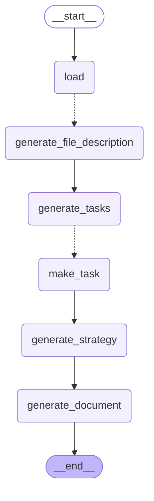

# Graf agenta (LangGraph)

Diagram generuje się automatycznie z kodu:
`graph.get_graph().draw_mermaid()` (zob. `graph.py`).

Przerywane strzałki (`-.->`) to krawędzie warunkowe z fan-outem przez `Send`:
- `__start__ → load` wczytuje akta,
- `load -.-> generate_file_description` — jedna gałąź na każdy dokument (równolegle),
- `generate_tasks -.-> make_task` — jedna gałąź na każde zadanie (równolegle).
