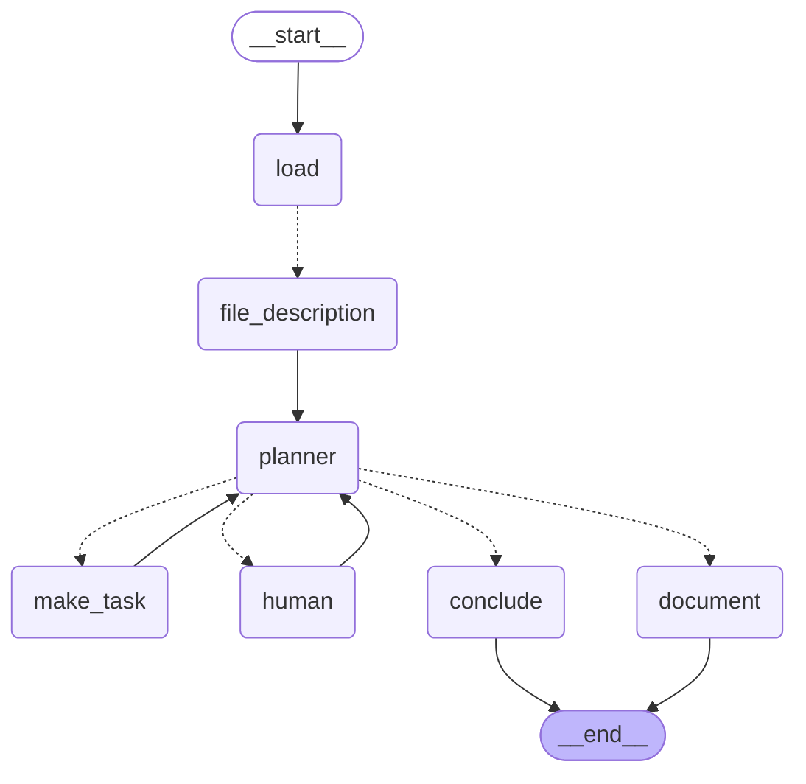

# Graf planera (agent nieliniowy)

Diagram generowany z kodu (`graph.get_graph().draw_mermaid()`, zob. `graph.py`).

**Planer jest centrum** — wszystko do niego wraca i to on decyduje, co dalej:
- `analyze` → `make_task` (fan-out po zadaniach) → z powrotem do `planner`,
- `ask_human` → `human` (pauza `interrupt`, czeka na radcę) → z powrotem do `planner`,
- `write` → `document` → koniec,
- `no_grounds` → `conclude` → koniec.

Pętle `make_task → planner` i `human → planner` to istota **nieliniowości** —
graf może zawracać, dopóki planer nie uzna, że ma dość (bezpiecznik: max rund).
